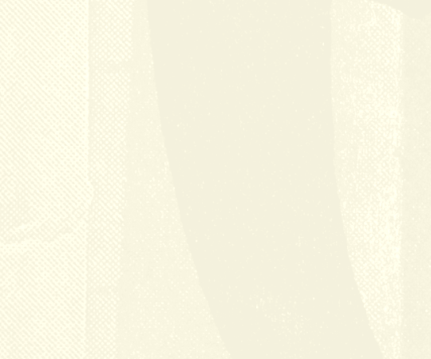

## Hi there, I'm Fateme 👋
🚀 Welcome to Fateme's Tech Universe 🌌

## 💬 About Me
I am an **Electronic Engineer** with a passion for **IoT and low-power wireless communication**. With a background in **Electrical Engineering**, I enjoy creating innovative solutions for real-world problems and exploring new technologies in **embedded systems** and **circuit design**.

## 🛠🌟 Skills & Technologies
- C/C++, Python
- Microcontrollers (Arduino, STM32, ESP32)
- Sensors & Actuators Integration
- Wireless Communication Protocols
- FPGA
## 💼 Experience
  - Lead the development of payment devices for payment industry ( POS, PIN-PAD, SIU ( Sensors and Indicators Unit )).
  - Designed and implemented firmware for microcontrollers.
  - Developed low-power .
  - Production Manager Point of sale (POS)
  - Technical Manager (Cell-phone After-Sales Services)
  - Quality Management

## 🔭 What I Do:
Working on cutting-edge projects involving microcontrollers, sensor integration, and low-power wireless communication.

- **Embedded System Design:** From schematic design to PCB layout and firmware development.
- **IoT Development:** Building connected devices such as pulse oximeter. 
- **Prototyping & Testing:** Rapid prototyping and rigorous testing to ensure functionality and reliability.

## 🌱 Learning & Development
- AIoT
- Python
- Machine learning (ML) 

## 📫 How to Reach Me
- **LinkedIn:** www.linkedin.com/in/fatemeh-sadouni
- **Email:** fatemeh.sadouni@gmail.com

## 🎯 Goals
Imagine a world where every device not only responds but adapts and learns.

## ⚡ Fun Fact
🌠Science fiction movies challenge me to imagine other planets, alternative universes, and advanced technologies, which helps me think more deeply about our world.
**too many creative ideas are inspired by these stories**

<!--
**fateme-sadouni/Fateme-Sadouni** is a ✨ _special_ ✨ repository because its `README.md` (this file) appears on your GitHub profile.

Here are some ideas to get you started:

- 🔭 I’m currently working on ...
- 🌱 I’m currently learning ...
- 👯 I’m looking to collaborate on ...
- 🤔 I’m looking for help with ...
- 💬 Ask me about ...
- 📫 How to reach me: ...
- 😄 Pronouns: ...
- ⚡ Fun fact: ...
-->
